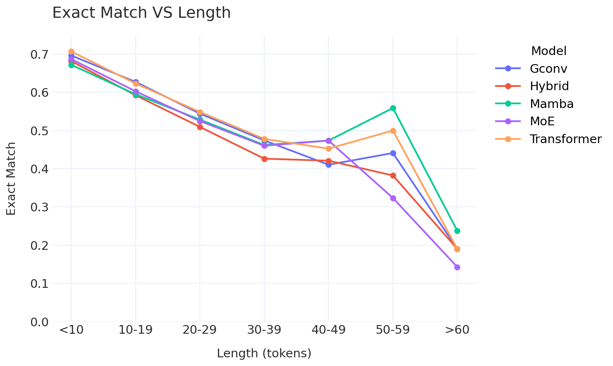

# Math2

Handwritten Mathematical Formula Recognition using Transformer, Mamba, Gated CNN, Hybrid and Mixture-of-Experts architectures.

## Overview

Math2 is a deep learning project for recognizing handwritten mathematical expressions from images and converting them into LaTeX markup.

The project was developed as a bachelor's thesis and includes:

* Multiple encoder-decoder architectures
* Training and evaluation pipelines
* Interactive Gradio interface
* Model export utilities
* Quantitative comparison of modern sequence modeling approaches

## Features

### Supported architectures

* Transformer
* Mamba
* Gated Convolution Network (GConv)
* Hybrid Transformer + Mamba
* Mixture of Experts (MoE)

### Functionality

* Recognition of handwritten mathematical formulas
* LaTeX sequence generation
* Beam Search decoding
* Greedy decoding
* Model benchmarking
* Hugging Face export
* Interactive web interface

## Dataset

The models were trained on a dataset containing approximately 230,000 mathematical expressions.

### Input

Image containing a handwritten mathematical formula.

### Output

Generated LaTeX representation.

Example:

Input image:

f(x)=x²+2x+1

Output:

```latex
f(x)=x^2+2x+1
```

## Results

| Model       | Exact Match | Accuracy | BLEU  |
| ----------- | ----------- | -------- | ----- |
| Transformer | 0.866       | 0.869    | 0.942 |
| GConv       | 0.863       | 0.870    | 0.943 |
| Mamba       | 0.854       | 0.859    | 0.937 |
| Hybrid      | 0.848       | 0.855    | 0.934 |
| MoE Hybrid  | 0.856       | 0.859    | 0.939 |



The Transformer architecture achieved the highest overall accuracy, while Mamba-based models demonstrated stronger behavior on longer sequences.

## Repository Structure

```text
Math2/
│
├── models/            # Neural network architectures
├── interface/         # Gradio UI
├── training.py        # Training pipeline
├── metrics.py         # Evaluation metrics
├── app.py             # Demo application
├── export.py          # Model export utilities
└── ...
```

## Installation

Clone the repository:

```bash
git clone https://github.com/EeveeSnow/Math2.git
cd Math2
```

Install dependencies:

for cuda 13.0

```bash
    pip3 install torch torchvision --index-url https://download.pytorch.org/whl/cu130
```

for cpu

```bash
    pip install torch torchvision
```

```bash
    pip install timm pathlib tqdm gradio datasets pandas nltk plotly SymPy antlr4-python3-runtime
```

only for mambda model

* Linux
* NVIDIA GPU Amper or better
* PyTorch 2.10
* CUDA 13.0

```bash
    pip install https://github.com/Dao-AILab/causal-conv1d/releases/download/v1.6.1.post4/causal_conv1d-1.6.1+cu13torch2.10cxx11abiTRUE-cp312-cp312-linux_x86_64.whl
    pip install https://github.com/state-spaces/mamba/releases/download/v2.3.1/mamba_ssm-2.3.1+cu13torch2.10cxx11abiTRUE-cp312-cp312-linux_x86_64.whl
```

## Running Demo

Launch the Gradio interface:

```bash
python app.py
```

After startup open:

```text
http://localhost:7860
```

## Training

Example training command:

```bash
python training.py
```

Training parameters can be configured inside the training configuration files.

## Technical Details

### Encoder

* Pretrained visual encoder
* Image feature extraction
* Transfer learning

### Decoder

* Autoregressive sequence generation
* Attention mechanisms
* Beam Search support

### Optimization

* AdamW optimizer
* Mixed precision training
* Separate learning rates for encoder and decoder
* Gradient accumulation

## Technologies

* Python
* PyTorch
* CUDA
* Gradio
* Hugging Face
* NumPy
* OpenCV

## Thesis

This repository accompanies the bachelor's thesis:

**Research and Development of Mathematical Formula Recognition Methods Using Modern Deep Learning Architectures**

The work includes a comparative study of Transformer, Mamba, Gated CNN and Mixture-of-Experts architectures for handwritten mathematical expression recognition.

## Future Work

* Larger vision encoders
* Distillation
* Quantization
* ONNX export
* Mobile inference
* Larger-scale datasets

## Author

Vyacheslav Krasilnikov

GitHub: https://github.com/EeveeSnow

## License

MIT License


